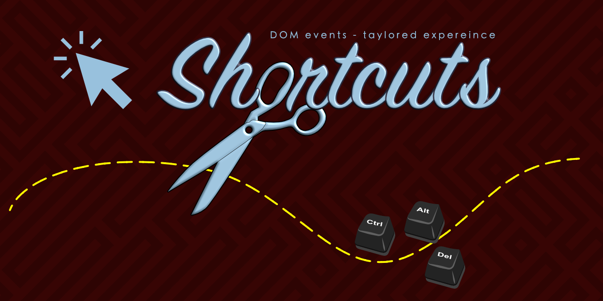

# Shortcuts (@peter.naydenov/shortcuts)


A shortcut management library that wrappes shortcut definitions in a context and allows to switch between contexts. Shortcuts are events triggered by keyboard, mouse, and DOM events. The library has a plugin system that makes the library extensible.

Currently existing plugins:
- `key`   - Converts keyboard events to shortcuts;
- `click` - Converts mouse events to shortcuts;
- `form`  - Form element changes to shortcuts;
- `hover` - Mouse hover events to shortcuts;
- `scroll` - Scroll events to shortcuts;


## Shortcut Description Rules
The shortcuts definition includes a context name and a set of rules(object). The rules are a set of key-value pairs. The key contains a plugin name and a shortcut name and the value is a function or array of functions, to be executed when the shortcut is triggered (action function).

### Per-Context Plugin Setup (Preferred Method)
Every plugin supports a `setup` event (e.g., `key:setup`, `click:setup`, `hover:setup`, `scroll:setup`) that allows you to configure plugin settings specifically for that context. This is the **preferred method** for customizing plugins as it provides:

- **Context-specific configuration** - Different settings for different contexts
- **Cleaner code** - No global plugin options needed
- **Better maintainability** - Settings are defined alongside the shortcuts they affect

The setup function receives:
- `dependencies` - External dependencies set via `setDependencies()`
- `defaults` - Default plugin options as a starting point

Example pattern:
```js
const shortcutDefinition = {
    context1: {
        'plugin:setup': ({ dependencies, defaults }) => {
            return {
                // Override specific options for this context
                option1: 'customValue1',
                option2: 123
            };
        },
        'plugin:event': () => { /* your action */ }
    }
};
```

See individual plugin sections for specific setup examples.

```js
// { context: { shortcutName: actionFunction } }
// or
// { context: { shortcutName: [ actionFunction1, actionFunction2 ] }}

// Shortcut definition object:
{
    contextName : {
                    shortcutName : function () {
                                                // do something
                                        }
                    , shortcutName : [ 
                                              function action1() {
                                                        // do something
                                                }
                                            , function action2() {
                                                        // do something
                                                }
                                    ]
                }
}
// shortcutName after v.3.0.0 have a plugin prefix. - 'pluginPrefix:shortcutName'. 
// For example:  'key:s+alt'   - for 's+alt' shortcut that is handled by 'key' plugin.
```

Load a shortcut definition by calling `load` method.

```js
// for es6 module projects:
import { shortcuts, pluginKey, pluginClick, pluginForm, pluginHover, pluginScroll } from '@peter.naydenov/shortcuts'
// for commonjs projects:
const { shortcuts, pluginKey, pluginClick, pluginForm, pluginHover, pluginScroll } = require('@peter.naydenov/shortcuts')


const short = shortcuts ();
// Load a needed plugins
// short.enablePlugin ( pluginCode, ?pluginOptions )
short.enablePlugin ( pluginKey ) 
short.enablePlugin ( pluginClick )
// Load a shortcut definition
short.load ( shortcutDefinition )

```

Shortcuts are working only if contex is active. To activate a context call `changeContext` method.

```js
short.changeContext ( contextName )
```

To deactivate a context without starting other context, call `changeContext` method without arguments.

```js
short.changeContext ()
```


## Plugin 'hover' Shortcut Descriptions
`Hover` plugin is used to detect when mouse enters or leaves specific HTML elements. The plugin supports two main events: hover on and hover off.

```js
hover:on    // Triggered when mouse enters a target element
hover:off   // Triggered when mouse leaves a target element
```

### Define Hover Targets
Target HTML elements for `hover` plugin are defined by `data-hover` attribute. The value of the attribute is the name of the target. Example:

```html
<div data-hover="menu">Menu content</div>
<!-- target name is 'menu' -->
```

Attribute is customizable by setting `hoverTarget` hover plugin option. By default, it checks for `['data-hover']`. You can provide an array of attribute names. Read more in section `Options`.


### Hover Action Functions
Hover plugin action functions receive the following arguments:

```js
function myHoverHandler ({
                  context     // (string) Name of the current context;
                , note        // (string) Name of the note or null if note isn't set;
                , dependencies // (object) Object with dependencies that you have set by calling `setDependencies` method;
                , target      // (DOM element). Target element of the hover event;
                , targetProps // (object). Coordinates of the target element (top, left, right, bottom, width, height) or null if target element is not available;
                , x           // (number). X coordinate of the target element;
                , y           // (number). Y coordinate of the target element;
                , event       // (object). Original hover event object;
          }) {
    // Body of the handler. Do something...
}
```

### Hover Detection Timing
Hover events are detected with a delay to avoid triggering when mouse quickly moves over elements. The default delay is 320ms but you can change it by setting `wait` hover plugin option.

```js
short.enablePlugin ( pluginHover, { wait: 500 }) // set the delay to 500ms
```

### Per-Context Setup (Preferred Method)
Instead of global plugin options, you can use `hover:setup` event to configure plugin settings per context. This is the preferred method for customization.

```js
const shortcutDefinition = {
    navigation: {
        'hover:setup': ({ dependencies, defaults }) => {
            // Customize hover settings for this context only
            return {
                wait: 200,           // Faster hover detection for navigation
                hoverTarget: ['data-nav-item', 'data-menu'] // Array of attribute names
            };
        },
        'hover:on': ({ target }) => {
            target.classList.add('active');
        },
        'hover:off': ({ target }) => {
            target.classList.remove('active');
        }
    },
    slowTooltips: {
        'hover:setup': ({ dependencies, defaults }) => {
            // Slower hover detection for tooltips
            return {
                wait: 800,           // Slower hover detection
                hoverTarget: ['data-tooltip', 'data-help'] // Different attributes for tooltips
            };
        },
        'hover:on': ({ target }) => {
            // Show tooltip with delay
            setTimeout(() => target.classList.add('visible'), 100);
        }
    }
};

short.enablePlugin(pluginHover);
short.load(shortcutDefinition);
short.changeContext('navigation'); // Uses navigation settings
// short.changeContext('slowTooltips'); // Uses tooltip settings
```

The `hover:setup` function receives:
- `dependencies` - External dependencies set via `setDependencies()`
- `defaults` - Default plugin options as a starting point or just for reference

Example usage:

```js
const shortcutDefinition = {
    navigation: {
        'hover:on': ({ target }) => {
            // Mouse entered the target
            target.classList.add('active');
        },
        'hover:off': ({ target }) => {
            // Mouse left the target
            target.classList.remove('active');
        }
    }
};

short.enablePlugin(pluginHover);
short.load(shortcutDefinition);
short.changeContext('navigation');
```

## Plugin 'scroll' Shortcut Descriptions
`Scroll` plugin is used to detect scroll events on the page. The plugin supports four main scroll directions:

```js
scroll:up     // Triggered when scrolling up
scroll:down   // Triggered when scrolling down
scroll:left   // Triggered when scrolling left
scroll:right  // Triggered when scrolling right
scroll:end    // Triggered when scrolling stops (after endScrollWait timeout)
```

### Scroll Detection Settings
Scroll events are detected with specific timing and distance thresholds to avoid excessive triggering. The default settings are:

- `scrollWait`: 50ms - Delay between scroll events
- `endScrollWait`: 400ms - Delay when scroll was stopped
- `minSpace`: 40px - Minimum distance between scroll events

These can be customized by setting scroll plugin options:

```js
short.enablePlugin ( pluginScroll, { 
    scrollWait: 100,      // set delay to 100ms
    endScrollWait: 600,   // set end scroll delay to 600ms
    minSpace: 60          // set minimum distance to 60px
})
```

### Per-Context Setup (Preferred Method)
Instead of global plugin options, you can use `scroll:setup` event to configure plugin settings per context. This is preferred method for customization.

```js
const shortcutDefinition = {
    sensitiveScrolling: {
        'scroll:setup': ({ dependencies, defaults }) => {
            // High sensitivity for gaming or precise interactions
            return {
                scrollWait: 20,       // Very responsive
                endScrollWait: 200,   // Quick end detection
                minSpace: 20          // Small movements trigger
            };
        },
        'scroll:up': () => console.log('Sensitive scroll up'),
        'scroll:down': () => console.log('Sensitive scroll down'),
        'scroll:end': () => console.log('Sensitive scroll ended')
    },
    lazyScrolling: {
        'scroll:setup': ({ dependencies, defaults }) => {
            // Low sensitivity for reading or casual browsing
            return {
                scrollWait: 150,      // Less responsive
                endScrollWait: 800,   // Slow end detection
                minSpace: 80          // Larger movements needed
            };
        },
        'scroll:up': () => console.log('Lazy scroll up'),
        'scroll:down': () => console.log('Lazy scroll down'),
        'scroll:end': () => console.log('Lazy scroll ended')
    }
};

short.enablePlugin(pluginScroll);
short.load(shortcutDefinition);
short.changeContext('sensitiveScrolling'); // Uses sensitive settings
// short.changeContext('lazyScrolling'); // Uses lazy settings
```

The `scroll:setup` function receives:
- `dependencies` - External dependencies set via `setDependencies()`
- `defaults` - Default plugin options as a starting point

### Scroll Action Functions
Scroll plugin action functions receive the following arguments:

```js
function myScrollHandler ({
                  context     // (string) Name of the current context;
                , note        // (string) Name of the note or null if note isn't set;
                , dependencies // (object) Object with dependencies that you have set by calling `setDependencies` method;
                , event       // (object). Original scroll event object;
          }) {
    // Body of the handler. Do something...
}
```

Example usage:

```js
const shortcutDefinition = {
    scrollView: {
        'scroll:up': () => {
            console.log('User scrolled up');
        },
        'scroll:down': () => {
            console.log('User scrolled down');
        },
        'scroll:end': () => {
            console.log('User stopped scrolling');
        }
    }
};

short.enablePlugin(pluginScroll);
short.load(shortcutDefinition);
short.changeContext('scrollView');
```

```

Shortcuts context has `note` that works like sub-contexts. Every shortcut function receives a context and note as arguments, so you can have fine control over the context.

```js
short.setNote ( 'special' ) // set note to 'special'
short.setNote () // remove the note
```

The idea of `note` is to minimize the number of contexts if they are very simular. You can use same context but change the `note` and control the shortcut execution from inside of the action function by checking the `note`.

```js
{
    contextName : {
                    shortcutName : function ( {context, note} ) {
                                        if ( note === 'special' ) {
                                                        // do something
                                            }
                                    }
                }
}
```

Context and notes are available inside action functions but you can check them from outside too.
Check current context by calling `getContext` method.

```js
short.getContext ()
```

Check notes by calling `getNote` method.

```js
short.getNote ()
```


## Plugin 'click' Shortcut Descriptions
Mouse event name is build from the following parts:
```js
 // click:<mouse button>-<number of clicks>-<modifier key>-<modifier key>-<modifier key>
 // example:
 // click: left-2 -> for double click with left mouse button
 // click: right-3 -> for triple click with right mouse button

 // mouse button options: left, right, middle
```

The modifier keys `ctrl`, `alt`, and `shift` are supported. They are added to the mouse event by sign `-`:

```js
 // example:
 // click: left-1-ctrl -> for single click with left mouse button and ctrl key pressed
```

Order of describing click event and modifier keys is not important.

```js
 // example:
 // click: ctrl-left-1 -> same as above

 // These 3 descriptions are equal:
 // click: left-1-ctrl-alt-shift
 // click: alt-shift-left-1-ctrl
 // click: left-1-shift-ctrl-alt
```

Multiple clicks are detected automatically by time interval between clicks. The default interval is 320ms but you can change it by setting `mouseWait` click plugin option.
```js
 short.enablePlugin ( pluginClick, { mouseWait: 500 }) // set the interval to 500ms
```

### Per-Context Setup (Preferred Method)
Instead of global plugin options, you can use `click:setup` event to configure plugin settings per context. This is preferred method for customization.

```js
const shortcutDefinition = {
    fastClicking: {
        'click:setup': ({ dependencies, defaults }) => {
            // Fast clicking for gaming or rapid interactions
            return {
                mouseWait: 150,      // Very fast click detection
                clickTarget: ['data-game-btn', 'data-action'] // Array of attributes for game buttons
            };
        },
        'click:left-1': ({ target }) => {
            console.log('Fast single click');
        },
        'click:left-2': ({ target }) => {
            console.log('Fast double click');
        }
    },
    slowClicking: {
        'click:setup': ({ dependencies, defaults }) => {
            // Slower clicking for form submissions or important actions
            return {
                mouseWait: 600,      // Slower click detection
                clickTarget: ['data-form-action', 'data-submit'] // Array of attributes for form actions
            };
        },
        'click:left-1': ({ target }) => {
            console.log('Deliberate single click');
        }
    }
};

short.enablePlugin(pluginClick);
short.load(shortcutDefinition);
short.changeContext('fastClicking'); // Uses fast settings
// short.changeContext('slowClicking'); // Uses slow settings
```

The `click:setup` function receives:
- `dependencies` - External dependencies set via `setDependencies()`
- `defaults` - Default plugin options as a starting point

Read more in section `Options`.


## Define a Click Targets
Target HTML elements for `shortcuts` are defined by `data-click` attribute. The value of the attribute is the name of the target. Example:

```html
<button data-click="id">Click me</button>
<!-- target name is 'id' -->
```

Attribute is customizable by setting `clickTarget` click plugin option. By default, it checks for `['data-click', 'href']`. You can provide an array of attribute names. Read more in section `Options`.

If current shortcuts context contain definition for 2 or more clicks, this may slow down the execution of single shortcuts because `shortcuts` will wait for the time interval to detect multiple clicks. To avoid this for specific targets, you can set `data-quick-click` attribute to the target element. Example:

```html
<button data-click="id" data-quick-click>Click me</button>
<!-- target name is 'id' and will not wait for more then 1 click -->
```
Using a <a> tag is a special case. It's always recognized as a target, and always with attribute `data-quick-click`. No need to set it manually. Example:

```html
<a href="#">Click me</a>
<!-- Recognized as a target and will not wait for more then 1 click -->
<!-- Take care for the action from shortcut `click: left-1`. -->
```

Clicking on <a> tag will execute default browser behaviour. In your `click:left-1` action function you can take the control. Example:

```js
{
    contextName : {
                    'click:left-1' : function ( {target, event} ) {
                                        if ( target.tagName === 'A' ) { // To prevent default action on <a> tag
                                                  event.preventDefault ()
                                                  // do something...
                                            }
                                    }
                }
}
```


## Plugin 'key' Event Descriptions
Keyboard event description contains a key name and a modifier keys if they are used. The modifier keys `ctrl`, `alt`, and `shift` are supported. They are added to the keyboard event by sign `+`:

```js
 // example:
 // key: ctrl+alt+shift+a -> for key 'a' with ctrl, alt and shift keys pressed
```

Keyboard event description support a shortcut sequenses. These means that you can press a sequence of keys to trigger a shortcut. The sequence elements are separated by sign "," ( coma ):

```js
 // example:
 // key: a,b,c -> for key 'a' then key 'b' then key 'c'

 // key: g+shift,o,t,o -> for key 'g' with shift, then key 'o', then key 't' then key 'o'
```

Order of describing keyboard event and modifier keys is not important, but sequence elements are:

```js
 // example:
 // key: a+ctrl,l,o,t -> a with ctrl, then l, then o, then t
 // this is equal to:
 // key: ctrl+a,l,o,t
 // but not equal to:
 // key: ctrl+a,o,t,l
```

Keyboard sequence is detected automatically by time interval between key presses. The default interval is 480ms but you can change it by setting `keyWait` key plugin option. Read more in section `Options`. 

### Per-Context Setup (Preferred Method)
Instead of global plugin options, you can use `key:setup` event to configure plugin settings per context. This is preferred method for customization.

```js
const shortcutDefinition = {
    fastTyping: {
        'key:setup': ({ dependencies, defaults }) => {
            // Fast key detection for gaming or rapid input
            return {
                keyWait: 200,       // Very fast sequence detection
                streamKeys: (key) => console.log('Key pressed:', key) // Enable key streaming
            };
        },
        'key:a,b,c': () => console.log('Fast sequence triggered'),
        'key:ctrl+s': () => console.log('Fast save')
    },
    slowTyping: {
        'key:setup': ({ dependencies, defaults }) => {
            // Slower key detection for accessibility or careful input
            return {
                keyWait: 800,       // Slower sequence detection
                streamKeys: false    // Disable key streaming
            };
        },
        'key:a,b,c': () => console.log('Slow sequence triggered'),
        'key:ctrl+s': () => console.log('Careful save')
    }
};

short.enablePlugin(pluginKey);
short.load(shortcutDefinition);
short.changeContext('fastTyping'); // Uses fast settings
// short.changeContext('slowTyping'); // Uses slow settings
```

The `key:setup` function receives:
- `dependencies` - External dependencies set via `setDependencies()`
- `defaults` - Default plugin options as a starting point

There is a way to disable automatic sequence detection and mark the begining and the end of the sequense by using a keyboard action functions. Read more in section `Keyboard Action Functions`.

Special characters that are available for your shortcut descriptions:
- 'left' - left arrow key
- 'right' - right arrow key
- 'up' - up arrow key
- 'down' - down arrow key
- 'enter' - enter key
- 'space' - space key
- 'esc' - escape key
- 'tab' - tab key
- 'backspace' - backspace key
- '=' - equal key
- F1 - F12 - function keys
- '/' - slash key
- '\\' - backslash key
- '[' - open square bracket key
- ']' - close square bracket key
- '`' - backtick key

**Warning**: For keys with two symbols(look at the keyboard), in shortcut description use the lower one. Examples: Use '=' instead of '+', use '/' instead of '?', etc. Modifier keys are available for special characters too.

**Warining**: Some of the shortcuts are used by OS and the browswer, so they are not available.


## Plugin 'form' Shortcut Descriptions
`Form` plugin is used to watch for changes in inputs, textareas, select and textarea elements. All 3 possible shortcuts are predefined: 'form: watch', 'form: define' and 'form: action'.
```js
`form: watch`  // (function). Should return list of elements to watch
`form: define` // (function). Define every element you are watching as a type(own definition).
`form: action` // (function). Function should return a list of objects with action function definitions.
```
Action definitions have 4 possible properties:
```js
{
   fn // (function) Action function
 , type // (string) Type of the element. Available types are according to `form: define` reponses
 , timing // (string) Possible values are: 'in', 'out', 'instant'
 , wait // (number) It's a event reducer timer in milliseconds. Worsk only for 'timing: instant'  
}
```

Definition Example:
```js
const shortcutScope = {
...
, 'form : watch' : ({dependencies}) => 'input, button' // Will select all inputs and buttons elements on the page.
, 'form : define' : ({ target, dependencies }) => { // Target is a DOM element selected by 'form: watch'
                    if ( target.tagName === 'INPUT' ) { // Will define inputs as 'input' type
                            return 'input' // (String) Custom according your preference
                        }
                    if ( target.tagName === 'BUTTON' ) { // Will define buttons as 'button' type
                            return 'button'
                        }
            }
, 'form : action' : ({ dependencies}) =>  [
                    {
                        fn: ({target}) => { console.log ( target)}
                      , type : 'input' // According to 'form: define'
                      , timing : 'in' // on focus in
                    },
                    {
                        // Dependencies is available in action functions
                        fn: ({target, dependencies }) => { console.log ( 'extra')}
                      , type : 'input'
                      , timing : 'in' // on focus in
                    },
                    {
                        fn: () => { console.log ( 'Update content') }
                      , type : 'input'
                      , timing : 'instant' // on content change. on each change
                      , wait : 500        // Wait 500ms between changes. 
                    },
                    {
                        fn: () => { console.log('It was a button') }
                      , type : 'button' // According to 'form: define'
                      , timing : 'out'  // on focus out
                    }
] // form: action
}
```
`form:watch` can contains `.someClass` for selecting elements by class name or `#someId` for selecting elements by id. It's could be everything that works in querySelectorAll. The `form:define` gives you a way to separate different inputs and privide a custom callback for each of them or use single callback for all inputs.

Plugin `form` has a default versions for `form:watch` and `form:define` functions. Only `form:action` is required but should use the default settings. Here are the defaults:
```js
const _defaults = {
      watch : () => 'input, select, textarea, button, a'
    , define: ({target}) => {
            if ( target.type === 'checkbox' || target.type === 'radio' ) {
                    return 'checkbox'
                }
            if ( target.type == 'button' || target.type=='submit' ) {
                    return 'button'
                }
            return 'input'
        } // define
} // defaults
```

If you want to pause of resume event from `form` plugin, call `short.pause(eventName)` and `short.resume(eventName)` where eventName is a `${type}/${timing}`. Take type and timing from action definitions.

### Per-Context Setup (Coming Soon)
The `form:setup` event is planned for future versions to allow per-context configuration of form plugin settings. Currently, form plugin uses default settings or global plugin options.

**Note**: In version 4.0.0, the `form:action` event now has access to `dependencies` at the top level, allowing you to minimize dependency declarations. Other named arguments are not available at the top level of `form:action`.


## Action Functions
Action functions are called when a shortcut is triggered. There is a difference among plugin action functions. Arguments are slightly different.


### Keyboard Action Functions
Description of `key` plugin action functions is:
```js
function myKeyHandler ({
                  context   // (string) Name of the current context;
                , note      // (string) Name of the note or null if note isn't set;
                , dependencies // (object) Object with dependencies that you have set by calling `setDependencies` method;
                , wait      // (function). Call it to stop a sequence timer and write shortcut sequence without a timer.
                , end       // (function). Recover the sequence timer;
                , ignore    // (function). Call it to ignore the current shortcut from the sequence;
                , isWaiting // (boolean). True if the sequence timer is active;
                        }) {
    // Body of the handler. Do something...
}
```


### Mouse Action Functions
Click plugin action functions can be described like:

```js
function myMouseHandler ({
                  context     // (string) Name of the current context;
                , note        // (string) Name of the note or null if note isn't set;
                , dependencies // (object) Object with dependencies that you have set by calling `setDependencies` method;
                , target      // (DOM element). Target element of the mouse event;
                , targetProps // (object). Coordinates of the target element (top, left, right, bottom, width, height) or null if target element is not available;
                , x           // (number). X coordinate of the target element;
                , y           // (number). Y coordinate of the target element;
                , event       // (object). Original mouse event object;
          }) {
    // Body of the handler. Do something...
}
```


## Methods

Description of the methods of shortcut instance:

```js
  load            : 'Load and extend a shortcut definition.'
, unload          : 'Remove a shortcut context with all its shortcuts.'

, enablePlugin    : 'Enable a plugin.'
, disablePlugin   : 'Disable a plugin.'
, mutePlugin      : 'Mute a plugin. All events for the plugin will be ignored.'
, unmutePlugin    : 'Unmute a plugin. All events for the plugin will be listened again.'

, changeContext   : 'Switch to existing shortcut context or shitch off the context(if no argument).'
, getContext      : 'Return a name of current context or null if there is no context selected'
, emit            : 'Trigger a shortcut or custom event programmatically.'
, pause           : 'Stop listening for shortcuts.'
, resume          : 'Resume listening for shortcuts.'
, listPlugins     : "Return list of enabled plugins. Plugins are represented by plugin's prefixes."
, listContexts    : 'Return list of available contexts.'
, listShortcuts   : 'Return list of shortcuts per context.'
, getNote         : `Return a name of current note or null if note isn't set`
, setNote         : 'Set a note to current context.'
, setDependencies : 'Set dependencies that will be available in action functions.'
, getDependencies : 'Return a dependencies object.'
, reset           : 'Reset shortcut instance.'
```

### How to 'pause' and 'resume'?
When you want to stop execution of shortcuts, call `short.pause()`. It's equal to `short.pause('*')`. Will stop all shortcuts in the active context. Stop for single shortcut is by calling `short.pause('shortcutName')`. To resume shortcuts execution call `short.resume()`. It's equal to `short.resume('*')`. Will resume all shortcuts in the active context. Resume for single shortcut is by calling `short.resume('shortcutName')`.

```js
// pause all shortcuts in the active context
short.pause () // will stop all shortcuts in the active context
short.resume ( 'shift+a' ) // will resume only 'shift+a' shortcut

short.resume ('*') // will resume all shortcuts
```


## Options

Shortcut receives `options` during the start. Here is the list of available options:

```js
 onShortcut    : 'Callback function that is called when a shortcut is triggered. Default value - false'
```
```js
const short = shortcut ({onShortcut: (shortcut) => console.log(shortcut) }) // Log in console each triggered shortcut
```


### Plugin 'key' options
```js
  keyWait       : 'Timeout for entering shortcut sequence in ms. Default value - 480'
, streamKeys    : 'False or a callback function that is called when a key is pressed. Default value - false'
```


### Plugin 'click' options
```js
  mouseWait     : 'Timeout for entering multiple mouse events. Default value - 320.'
, clickTarget   : 'Array of attribute names to recognize click items in HTML. Default value - ["data-click", "href"]' // checks for data-click='someName' or href attributes
```

### Plugin 'hover' options
```js
  wait          : 'Time to wait for hover sequence in ms. Default value - 320.'
, hoverTarget   : 'Array of attribute names to recognize hover items in HTML. Default value - ["data-hover"]' // checks for data-hover='someName' attribute
```

### Plugin 'scroll' options
```js
  scrollWait    : 'Delay between scroll events in ms. Default value - 50.'
, endScrollWait : 'Delay when scroll was stopped in ms. Default value - 400.'
, minSpace      : 'Minimum distance between scroll events in px. Default value - 40.'
```

Plugin options are provided as a second argument during the plugin enabling. It's look like this:
  
```js
  short.enablePlugin ( pluginKey, {
                             keyWait: 500 // set the interval to 500ms
                           , streamKeys: (key) => console.log(key)   // Log in console each pressed key
                      })

  short.enablePlugin ( pluginClick, {
                             mouseWait: 200     // set the interval between multiple clicks to 200ms
                           , clickTarget: ['data-puk', 'data-button'] // array of attribute names to check
                      })

  short.enablePlugin ( pluginHover, {
                             wait: 500         // set the hover delay to 500ms
                           , hoverTarget: ['data-hover-me', 'data-interactive'] // array of attribute names to check
                      })

  short.enablePlugin ( pluginScroll, {
                             scrollWait: 100      // set the delay between scroll events to 100ms
                           , endScrollWait: 600   // set the end scroll delay to 600ms
                           , minSpace: 60         // set minimum distance to 60px
                      })

```


### onShortcut option
```js
 function onShortcut ({ shortcut, context, note, dependencies }) {
        // shortcut - (string) Triggered shortcut name
        // context - (string) Name of the current context
        // note - (string) Name of the note or null if note isn't set
        // dependencies - (object) Object with dependencies that you have set by calling `setDependencies` method
    }
```


### streamKeys option
```js
 function streamKeys ({ key, context, note, dependencies }) {
        // key - (string) Pressed key name
        // context - (string) Name of the current context
        // note - (string) Name of the note or null if note isn't set
        // dependencies - (object) Object with dependencies that you have set by calling `setDependencies` method
    }
```


## TypeScript Support

The library includes TypeScript definitions. Install the package and TypeScript will automatically detect the types.

```typescript
import { shortcuts, pluginKey, pluginClick, pluginForm, pluginHover, pluginScroll } from '@peter.naydenov/shortcuts';

const short: ShortcutsAPI = shortcuts();
const shortcutPlugins = [ pluginKey, pluginClick, pluginForm, pluginHover, pluginScroll ];
shortcutPlugins.forEach( plugin => short.enablePlugin(plugin) );


// Type-safe shortcut definitions
const shortcutDefinition = {
  myContext: {
    'key:ctrl+s': () => console.log('Saved'),
    'click:left-1': (args: { target: HTMLElement }) => console.log('Clicked', args.target),
    'hover:on': (args: { target: HTMLElement }) => console.log('Hovered', args.target),
    'scroll:down': () => console.log('Scrolled down'),
    'scroll:end': () => console.log('Scrolling ended')
  }
};

short.load(shortcutDefinition);
short.changeContext('myContext');
```

The `ShortcutsAPI` interface provides full type safety for all methods and their parameters.

## Links

- [History of changes](https://github.com/PeterNaydenov/shortcuts/blob/main/Changelog.md)
- [Migration guide](https://github.com/PeterNaydenov/shortcuts/blob/main/Migration.guide.md)
- [How to make a plugin](https://github.com/PeterNaydenov/shortcuts/blob/main/How.to.make.plugins.md)


## Credits
'@peter.naydenov/shortcuts' was created and supported by Peter Naydenov.


## License
'@peter.naydenov/shortcuts' is released under the MIT License.