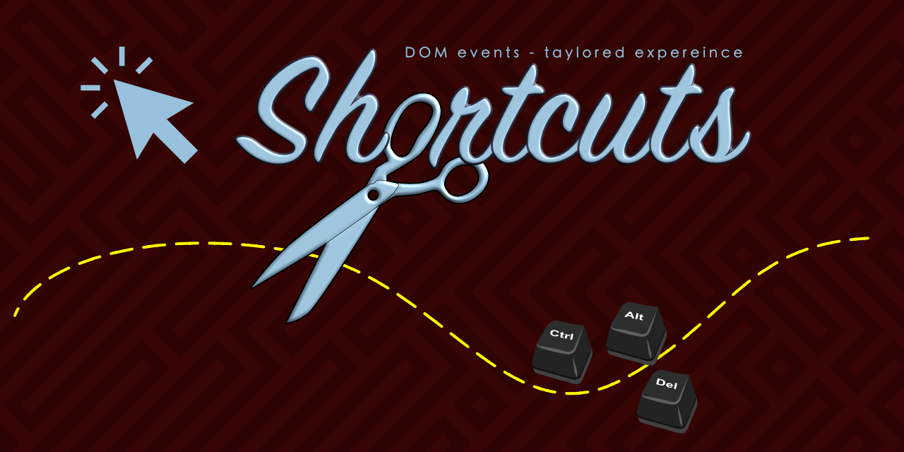

# Shortcuts (@peter.naydenov/shortcuts)


A shortcut management library that wrappes shortcut definitions in a context and allows to switch between contexts. Shortcuts are events triggered by keyboard, mouse, and DOM events. The library has a plugin system that makes the library extensible.

Currently existing plugins:
- `key`   - Converts keyboard events to shortcuts;
- `click` - Converts mouse events to shortcuts;
- `form`  - Form element changes to shortcuts;
- `hover` - Mouse hover events to shortcuts;
- `scroll` - Scroll events to shortcuts;


## Table of Contents
1. [Quick Start](#quick-start)
2. [Concepts](#concepts)
3. [Constructor Options](#constructor-options)
4. [Per-Plugin Options](#per-plugin-options)
5. [Shortcut Description Rules](#shortcut-description-rules)
6. [Per-Context Setup vs `enablePlugin` Options](#per-context-setup-vs-enableplugin-options)
7. [Plugin Reference](#plugin-reference)
   - [Plugin 'key'](#plugin-key-shortcut-descriptions)
   - [Plugin 'click'](#plugin-click-shortcut-descriptions)
   - [Plugin 'hover'](#plugin-hover-shortcut-descriptions)
   - [Plugin 'scroll'](#plugin-scroll-shortcut-descriptions)
   - [Plugin 'form'](#plugin-form-shortcut-descriptions)
8. [Action Function Signatures](#action-functions)
9. [Methods](#methods)
10. [Contexts, Notes, and Dependencies](#contexts-notes-and-dependencies)
11. [Errors and the `errorEventName` Channel](#errors-and-the-erroreventname-channel)
12. [Custom Events & Workflows](#custom-events--workflows)
13. [TypeScript Support](#typescript-support)
14. [Links](#links)


## Quick Start

```js
// for es6 module projects:
import { shortcuts, pluginKey, pluginClick, pluginForm, pluginHover, pluginScroll } from '@peter.naydenov/shortcuts'
// for commonjs projects:
const { shortcuts, pluginKey, pluginClick, pluginForm, pluginHover, pluginScroll } = require('@peter.naydenov/shortcuts')


const short = shortcuts ();
// Load needed plugins.  Second argument is per-plugin options.
short.enablePlugin ( pluginKey )
short.enablePlugin ( pluginClick )
// Load a shortcut definition
short.load ( shortcutDefinition )
// Activate a context to start listening.
short.changeContext ( 'editor' )
```

To stop all shortcuts without activating another context:

```js
short.changeContext ()   // deactivates the current context
```

See [Shortcut Description Rules](#shortcut-description-rules) for the shape of `shortcutDefinition`, and [Methods](#methods) for the full API.


## Concepts

- **Shortcut** — a single rule like `'key: ctrl+s'` or `'click: left-1'` that is triggered by a physical event.
- **Action function** — the function (or array of functions) executed when a shortcut fires. Each plugin passes a different `data` object to it (see [Action Functions](#action-functions)).
- **Context** — a named bucket of shortcuts. Only one context is active at a time; `changeContext(name)` switches between them.
- **Note** — a sub-context tag that lives inside the current context. Lets a single context react differently to the same shortcut under different notes. Set with `setNote('foo')`, read inside the action as `data.note`.
- **Plugin** — the layer that converts physical input into shortcut events (`key`, `click`, `hover`, `scroll`, `form`).
- **Custom event** — any string (typically namespaced with `@` or `app:`) that you can `emit` and `listen` to. See [Custom Events & Workflows](#custom-events--workflows).


## Constructor Options

`shortcuts(options)` accepts:

| Option | Type | Default | Description |
|---|---|---|---|
| `onShortcut` | `function` | `false` | Called for every triggered shortcut in the current context (including programmatically emitted events). |
| `errorEventName` | `string` | `'@shortcuts-error'` | Name of the event on which the library publishes error messages. See [Errors and the `errorEventName` Channel](#errors-and-the-erroreventname-channel). |
| `streamKeys` | `function` | `false` | Called on every key press while the `key` plugin is active. Equivalent to passing `streamKeys` to `enablePlugin(pluginKey, …)`. |

```js
const short = shortcuts ({
        onShortcut   : ({ shortcut, context }) => console.log ( shortcut, 'in', context )
      , errorEventName : '@my-app-shortcut-errors'
});
```

### `onShortcut({ shortcut, context, note, dependencies })`
```js
function onShortcut ({ shortcut, context, note, dependencies }) {
    // shortcut      - (string) Triggered shortcut name (e.g. 'KEY:CTRL+S')
    // context       - (string) Name of the current context
    // note          - (string) Name of the note or null if note isn't set
    // dependencies  - (object) Object with dependencies that you have set by calling `setDependencies` method
}
```

### `streamKeys({ key, context, note, dependencies })`
```js
function streamKeys ({ key, context, note, dependencies }) {
    // key           - (string) Pressed key name
    // context       - (string) Name of the current context
    // note          - (string) Name of the note or null if note isn't set
    // dependencies  - (object) Object with dependencies that you have set by calling `setDependencies` method
}
```


## Per-Plugin Options

These are passed as the second argument of `enablePlugin(plugin, options)`. To override per-context, use the `plugin:setup` event — see [Per-Context Setup vs `enablePlugin` Options](#per-context-setup-vs-enableplugin-options).

### Plugin 'key' options
```js
  keyWait       : 'Timeout for entering shortcut sequence in ms. Default value - 480'
, streamKeys    : 'False or a callback function that is called when a key is pressed. Default value - false'
```

### Plugin 'click' options
```js
  mouseWait     : 'Timeout for entering multiple mouse events. Default value - 320.'
, clickTarget   : 'Array of attribute names to recognize click items in HTML. Default value - ["data-click", "href"]' // checks for data-click='someName' or href attributes
```

### Plugin 'hover' options
```js
  wait          : 'Time to wait for hover sequence in ms. Default value - 320.'
, hoverTarget   : 'Array of attribute names to recognize hover items in HTML. Default value - ["data-hover"]' // checks for data-hover='someName' attribute
```

### Plugin 'scroll' options
```js
  scrollWait    : 'Delay between scroll events in ms. Default value - 50.'
, endScrollWait : 'Delay when scroll was stopped in ms. Default value - 400.'
, minSpace      : 'Minimum distance between scroll events in px. Default value - 40.'
```

Plugin options are provided as a second argument during the plugin enabling:

```js
  short.enablePlugin ( pluginKey, {
                             keyWait: 500 // set the interval to 500ms
                           , streamKeys: (key) => console.log(key)   // Log in console each pressed key
                      })

  short.enablePlugin ( pluginClick, {
                             mouseWait: 200     // set the interval between multiple clicks to 200ms
                           , clickTarget: ['data-puk', 'data-button'] // array of attribute names to check
                      })

  short.enablePlugin ( pluginHover, {
                             wait: 500         // set the hover delay to 500ms
                           , hoverTarget: ['data-hover-me', 'data-interactive'] // array of attribute names to check
                      })

  short.enablePlugin ( pluginScroll, {
                             scrollWait: 100      // set the delay between scroll events to 100ms
                           , endScrollWait: 600   // set the end scroll delay to 600ms
                           , minSpace: 60         // set minimum distance to 60px
                      })
```


## Shortcut Description Rules

The shortcuts definition includes a context name and a set of rules (object). The rules are a set of key-value pairs. The key contains a plugin name and a shortcut name and the value is a function or array of functions, to be executed when the shortcut is triggered (action function).

```js
// { context: { shortcutName: actionFunction } }
// or
// { context: { shortcutName: [ actionFunction1, actionFunction2 ] }}

// Shortcut definition object:
{
    contextName : {
                    shortcutName : function () {
                                                // do something
                                        }
                    , shortcutName : [
                                              function action1() {
                                                        // do something
                                                }
                                            , function action2() {
                                                        // do something
                                                }
                                    ]
                }
}
// shortcutName after v.3.0.0 have a plugin prefix. - 'pluginPrefix:shortcutName'.
// For example:  'key:s+alt'   - for 's+alt' shortcut that is handled by 'key' plugin.
```

Load a shortcut definition by calling `load` method.

```js
const short = shortcuts ();
short.enablePlugin ( pluginKey )
short.enablePlugin ( pluginClick )
short.load ( shortcutDefinition )
short.changeContext ( contextName )   // activate a context
```

Shortcuts only fire while a context is active. To deactivate a context without starting another, call `changeContext` with no argument.

```js
short.changeContext () // deactivates the current context
```


## Per-Context Setup vs `enablePlugin` Options

There are two ways to configure a plugin:

1. **Globally** — pass options to `enablePlugin(plugin, options)`. They apply to every context that uses that plugin.
2. **Per-context** — define a `plugin:setup` event inside the context object. The function receives `{ dependencies, defaults }` and returns an options object that overrides the defaults **for that context only**. The supported events are `key:setup`, `click:setup`, `hover:setup`, and `scroll:setup`.

**Per-context setup is the preferred method** because:
- Different contexts can use different settings (e.g. fast clicks in a game context, deliberate clicks in a form context).
- The configuration lives next to the shortcuts that depend on it.
- You don't have to re-enable the plugin when switching contexts.

The setup function receives:
- `dependencies` - External dependencies set via `setDependencies()`
- `defaults` - Default plugin options as a starting point or just for reference. Use them to read or partially override.

Example pattern (applies to every plugin that supports `setup`):

```js
const shortcutDefinition = {
    context1: {
        'plugin:setup': ({ dependencies, defaults }) => {
            return {
                // Override specific options for this context
                option1: 'customValue1',
                option2: 123
            };
        },
        'plugin:event': () => { /* your action */ }
    }
};
```

See individual plugin sections for specific setup examples (`key:setup`, `click:setup`, `hover:setup`, `scroll:setup`).

**Rule of thumb:** use `enablePlugin(plugin, options)` only for values you want to be global to the app. Use `plugin:setup` for anything that varies by context.


## Plugin Reference


### Plugin 'key' Shortcut Descriptions

Keyboard event description contains a key name and a modifier keys if they are used. The modifier keys `ctrl`, `alt`, and `shift` are supported. They are added to the keyboard event by sign `+`:

```js
 // example:
 // key: ctrl+alt+shift+a -> for key 'a' with ctrl, alt and shift keys pressed
```

Keyboard event description support a shortcut sequenses. These means that you can press a sequence of keys to trigger a shortcut. The sequence elements are separated by sign "," ( coma ):

```js
 // example:
 // key: a,b,c -> for key 'a' then key 'b' then key 'c'

 // key: g+shift,o,t,o -> for key 'g' with shift, then key 'o', then key 't' then key 'o'
```

Order of describing keyboard event and modifier keys is not important, but sequence elements are:

```js
 // example:
 // key: a+ctrl,l,o,t -> a with ctrl, then l, then o, then t
 // this is equal to:
 // key: ctrl+a,l,o,t
 // but not equal to:
 // key: ctrl+a,o,t,l
```

Keyboard sequence is detected automatically by time interval between key presses. The default interval is 480ms but you can change it by setting `keyWait` key plugin option. Read more in section `Per-Plugin Options`.

#### Per-Context Setup (Preferred Method)
Instead of global plugin options, you can use `key:setup` event to configure plugin settings per context. This is preferred method for customization.

```js
const shortcutDefinition = {
    fastTyping: {
        'key:setup': ({ dependencies, defaults }) => {
            // Fast key detection for gaming or rapid input
            return {
                keyWait: 200,       // Very fast sequence detection
                streamKeys: (key) => console.log('Key pressed:', key) // Enable key streaming
            };
        },
        'key:a,b,c': () => console.log('Fast sequence triggered'),
        'key:ctrl+s': () => console.log('Fast save')
    },
    slowTyping: {
        'key:setup': ({ dependencies, defaults }) => {
            // Slower key detection for accessibility or careful input
            return {
                keyWait: 800,       // Slower sequence detection
                streamKeys: false    // Disable key streaming
            };
        },
        'key:a,b,c': () => console.log('Slow sequence triggered'),
        'key:ctrl+s': () => console.log('Careful save')
    }
};

short.enablePlugin(pluginKey);
short.load(shortcutDefinition);
short.changeContext('fastTyping'); // Uses fast settings
// short.changeContext('slowTyping'); // Uses slow settings
```

The `key:setup` function receives:
- `dependencies` - External dependencies set via `setDependencies()`
- `defaults` - Default plugin options as a starting point

There is a way to disable automatic sequence detection and mark the begining and the end of the sequense by using a keyboard action functions. Read more in section [Action Functions → Keyboard Action Functions](#keyboard-action-functions).

Special characters that are available for your shortcut descriptions:
- 'left' - left arrow key
- 'right' - right arrow key
- 'up' - up arrow key
- 'down' - down arrow key
- 'enter' - enter key
- 'space' - space key
- 'esc' - escape key
- 'tab' - tab key
- 'backspace' - backspace key
- '=' - equal key
- F1 - F12 - function keys
- '/' - slash key
- '\\' - backslash key
- '[' - open square bracket key
- ']' - close square bracket key
- '`' - backtick key

**Warning**: For keys with two symbols(look at the keyboard), in shortcut description use the lower one. Examples: Use '=' instead of '+', use '/' instead of '?', etc. Modifier keys are available for special characters too.

**Warining**: Some of the shortcuts are used by OS and the browswer, so they are not available.


### Plugin 'click' Shortcut Descriptions

Mouse event name is build from the following parts:
```js
 // click:<mouse button>-<number of clicks>-<modifier key>-<modifier key>-<modifier key>
 // example:
 // click: left-2 -> for double click with left mouse button
 // click: right-3 -> for triple click with right mouse button

 // mouse button options: left, right, middle
```

The modifier keys `ctrl`, `alt`, and `shift` are supported. They are added to the mouse event by sign `-`:

```js
 // example:
 // click: left-1-ctrl -> for single click with left mouse button and ctrl key pressed
```

Order of describing click event and modifier keys is not important.

```js
 // example:
 // click: ctrl-left-1 -> same as above

 // These 3 descriptions are equal:
 // click: left-1-ctrl-alt-shift
 // click: alt-shift-left-1-ctrl
 // click: left-1-shift-ctrl-alt
```

Multiple clicks are detected automatically by time interval between clicks. The default interval is 320ms but you can change it by setting `mouseWait` click plugin option.
```js
 short.enablePlugin ( pluginClick, { mouseWait: 500 }) // set the interval to 500ms
```

#### Per-Context Setup (Preferred Method)
Instead of global plugin options, you can use `click:setup` event to configure plugin settings per context. This is preferred method for customization.

```js
const shortcutDefinition = {
    fastClicking: {
        'click:setup': ({ dependencies, defaults }) => {
            // Fast clicking for gaming or rapid interactions
            return {
                mouseWait: 150,      // Very fast click detection
                clickTarget: ['data-game-btn', 'data-action'] // Array of attributes for game buttons
            };
        },
        'click:left-1': ({ target }) => {
            console.log('Fast single click');
        },
        'click:left-2': ({ target }) => {
            console.log('Fast double click');
        }
    },
    slowClicking: {
        'click:setup': ({ dependencies, defaults }) => {
            // Slower clicking for form submissions or important actions
            return {
                mouseWait: 600,      // Slower click detection
                clickTarget: ['data-form-action', 'data-submit'] // Array of attributes for form submissions
            };
        },
        'click:left-1': ({ target }) => {
            console.log('Deliberate single click');
        }
    }
};

short.enablePlugin(pluginClick);
short.load(shortcutDefinition);
short.changeContext('fastClicking'); // Uses fast settings
// short.changeContext('slowClicking'); // Uses slow settings
```

The `click:setup` function receives:
- `dependencies` - External dependencies set via `setDependencies()`
- `defaults` - Default plugin options as a starting point

Read more in section `Per-Plugin Options`.


### Define a Click Targets

Target HTML elements for `shortcuts` are defined by `data-click` attribute. The value of the attribute is the name of the target. Example:

```html
<button data-click="id">Click me</button>
<!-- target name is 'id' -->
```

Attribute is customizable by setting `clickTarget` click plugin option. By default, it checks for `['data-click', 'href']`. You can provide an array of attribute names. Read more in section `Per-Plugin Options`.

If current shortcuts context contain definition for 2 or more clicks, this may slow down the execution of single shortcuts because `shortcuts` will wait for the time interval to detect multiple clicks. To avoid this for specific targets, you can set `data-quick-click` attribute to the target element. Example:

```html
<button data-click="id" data-quick-click>Click me</button>
<!-- target name is 'id' and will not wait for more then 1 click -->
```
Using a <a> tag is a special case. It's always recognized as a target, and always with attribute `data-quick-click`. No need to set it manually. Example:

```html
<a href="#">Click me</a>
<!-- Recognized as a target and will not wait for more then 1 click -->
<!-- Take care for the action from shortcut `click: left-1`. -->
```

Clicking on <a> tag will execute default browser behaviour. In your `click:left-1` action function you can take the control. Example:

```js
{
    contextName : {
                    'click:left-1' : function ( {target, event} ) {
                                        if ( target.tagName === 'A' ) { // To prevent default action on <a> tag
                                                  event.preventDefault ()
                                                  // do something...
                                            }
                                    }
                }
}
```


### Plugin 'hover' Shortcut Descriptions

`Hover` plugin is used to detect when mouse enters or leaves specific HTML elements. The plugin supports two main events: hover on and hover off.

```js
hover:on    // Triggered when mouse enters a target element
hover:off   // Triggered when mouse leaves a target element
```

#### Define Hover Targets
Target HTML elements for `hover` plugin are defined by `data-hover` attribute. The value of the attribute is the name of the target. Example:

```html
<div data-hover="menu">Menu content</div>
<!-- target name is 'menu' -->
```

Attribute is customizable by setting `hoverTarget` hover plugin option. By default, it checks for `['data-hover']`. You can provide an array of attribute names. Read more in section `Per-Plugin Options`.


### Hover Detection Timing
Hover events are detected with a delay to avoid triggering when mouse quickly moves over elements. The default delay is 320ms but you can change it by setting `wait` hover plugin option.

```js
short.enablePlugin ( pluginHover, { wait: 500 }) // set the delay to 500ms
```

#### Per-Context Setup (Preferred Method)
Instead of global plugin options, you can use `hover:setup` event to configure plugin settings per context. This is the preferred method for customization.

```js
const shortcutDefinition = {
    navigation: {
        'hover:setup': ({ dependencies, defaults }) => {
            // Customize hover settings for this context only
            return {
                wait: 200,           // Faster hover detection for navigation
                hoverTarget: ['data-nav-item', 'data-menu'] // Array of attribute names
            };
        },
        'hover:on': ({ target }) => {
            target.classList.add('active');
        },
        'hover:off': ({ target }) => {
            target.classList.remove('active');
        }
    },
    slowTooltips: {
        'hover:setup': ({ dependencies, defaults }) => {
            // Slower hover detection for tooltips
            return {
                wait: 800,           // Slower hover detection
                hoverTarget: ['data-tooltip', 'data-help'] // Different attributes for tooltips
            };
        },
        'hover:on': ({ target }) => {
            // Show tooltip with delay
            setTimeout(() => target.classList.add('visible'), 100);
        }
    }
};

short.enablePlugin(pluginHover);
short.load(shortcutDefinition);
short.changeContext('navigation'); // Uses navigation settings
// short.changeContext('slowTooltips'); // Uses tooltip settings
```

The `hover:setup` function receives:
- `dependencies` - External dependencies set via `setDependencies()`
- `defaults` - Default plugin options as a starting point or just for reference

Example usage:

```js
const shortcutDefinition = {
    navigation: {
        'hover:on': ({ target }) => {
            // Mouse entered the target
            target.classList.add('active');
        },
        'hover:off': ({ target }) => {
            // Mouse left the target
            target.classList.remove('active');
        }
    }
};

short.enablePlugin(pluginHover);
short.load(shortcutDefinition);
short.changeContext('navigation');
```


### Plugin 'scroll' Shortcut Descriptions

`Scroll` plugin is used to detect scroll events on the page. The plugin supports four main scroll directions:

```js
scroll:up     // Triggered when scrolling up
scroll:down   // Triggered when scrolling down
scroll:left   // Triggered when scrolling left
scroll:right  // Triggered when scrolling right
scroll:end    // Triggered when scrolling stops (after endScrollWait timeout)
```

#### Scroll Detection Settings
Scroll events are detected with specific timing and distance thresholds to avoid excessive triggering. The default settings are:

- `scrollWait`: 50ms - Delay between scroll events
- `endScrollWait`: 400ms - Delay when scroll was stopped
- `minSpace`: 40px - Minimum distance between scroll events

These can be customized by setting scroll plugin options:

```js
short.enablePlugin ( pluginScroll, {
    scrollWait: 100,      // set delay to 100ms
    endScrollWait: 600,   // set end scroll delay to 600ms
    minSpace: 60          // set minimum distance to 60px
})
```

#### Per-Context Setup (Preferred Method)
Instead of global plugin options, you can use `scroll:setup` event to configure plugin settings per context. This is preferred method for customization.

```js
const shortcutDefinition = {
    sensitiveScrolling: {
        'scroll:setup': ({ dependencies, defaults }) => {
            // High sensitivity for gaming or precise interactions
            return {
                scrollWait: 20,       // Very responsive
                endScrollWait: 200,   // Quick end detection
                minSpace: 20          // Small movements trigger
            };
        },
        'scroll:up': () => console.log('Sensitive scroll up'),
        'scroll:down': () => console.log('Sensitive scroll down'),
        'scroll:end': () => console.log('Sensitive scroll ended')
    },
    lazyScrolling: {
        'scroll:setup': ({ dependencies, defaults }) => {
            // Low sensitivity for reading or casual browsing
            return {
                scrollWait: 150,      // Less responsive
                endScrollWait: 800,   // Slow end detection
                minSpace: 80          // Larger movements needed
            };
        },
        'scroll:up': () => console.log('Lazy scroll up'),
        'scroll:down': () => console.log('Lazy scroll down'),
        'scroll:end': () => console.log('Lazy scroll ended')
    }
};

short.enablePlugin(pluginScroll);
short.load(shortcutDefinition);
short.changeContext('sensitiveScrolling'); // Uses sensitive settings
// short.changeContext('lazyScrolling'); // Uses lazy settings
```

The `scroll:setup` function receives:
- `dependencies` - External dependencies set via `setDependencies()`
- `defaults` - Default plugin options as a starting point

Example usage:

```js
const shortcutDefinition = {
    scrollView: {
        'scroll:up': () => {
            console.log('User scrolled up');
        },
        'scroll:down': () => {
            console.log('User scrolled down');
        },
        'scroll:end': () => {
            console.log('User stopped scrolling');
        }
    }
};

short.enablePlugin(pluginScroll);
short.load(shortcutDefinition);
short.changeContext('scrollView');
```

Shortcuts context has `note` that works like sub-contexts. Every shortcut function receives a context and note as arguments, so you can have fine control over the context. See [Contexts, Notes, and Dependencies](#contexts-notes-and-dependencies).


### Plugin 'form' Shortcut Descriptions

`Form` plugin is used to watch for changes in inputs, textareas, select and textarea elements. All 3 possible shortcuts are predefined: `form: watch`, `form: define` and `form: action`.

```js
form: watch    // (function). Should return list of elements to watch
form: define   // (function). Define every element you are watching as a type (own definition)
form: action   // (function). Must return a list of step objects. Each step has a fn, type, timing and optional wait
```

#### Action definition step shape

`form:action` returns an array of steps. Each step has four possible properties:

```js
{
   fn     // (function) Action function. Receives FormEventData.
 , type   // (string) Type of the element. Must match a value returned by `form: define`
 , timing // (string) 'in' (focus in), 'out' (focus out), or 'instant' (value change)
 , wait   // (number) Event-reducer timer in ms. Only used when `timing: 'instant'`.
}
```

- `timing: 'in'` fires once when focus enters the element.
- `timing: 'out'` fires once when focus leaves the element.
- `timing: 'instant'` fires on each value change but is throttled by `wait` ms so the action doesn't run on every keystroke.

#### Definition example

```js
const shortcutScope = {
...
, 'form : watch' : ({dependencies}) => 'input, button' // Will select all inputs and buttons elements on the page.
, 'form : define' : ({ target, dependencies }) => { // Target is a DOM element selected by 'form: watch'
                    if ( target.tagName === 'INPUT' ) { // Will define inputs as 'input' type
                            return 'input' // (String) Custom according your preference
                        }
                    if ( target.tagName === 'BUTTON' ) { // Will define buttons as 'button' type
                            return 'button'
                        }
            }
, 'form : action' : ({ dependencies}) =>  [
                    {
                        fn: ({target}) => { console.log ( target)}
                      , type : 'input' // According to 'form: define'
                      , timing : 'in' // on focus in
                    },
                    {
                        // Dependencies is available in action functions
                        fn: ({target, dependencies }) => { console.log ( 'extra')}
                      , type : 'input'
                      , timing : 'in' // on focus in
                    },
                    {
                        fn: () => { console.log ( 'Update content') }
                      , type : 'input'
                      , timing : 'instant' // on content change. on each change
                      , wait : 500        // Wait 500ms between changes.
                    },
                    {
                        fn: () => { console.log('It was a button') }
                      , type : 'button' // According to 'form: define'
                      , timing : 'out'  // on focus out
                    }
] // form: action
}
```

`form:watch` can contain `.someClass` for selecting elements by class name or `#someId` for selecting elements by id. It's could be everything that works in `querySelectorAll`. The `form:define` gives you a way to separate different inputs and privide a custom callback for each of them or use single callback for all inputs.

#### Default `form:watch` and `form:define`

The `form` plugin ships with defaults for `form:watch` and `form:define`. Only `form:action` is required.

```js
const _defaults = {
      watch : () => 'input, select, textarea, button, a'
    , define: ({target}) => {
            if ( target.type === 'checkbox' || target.type === 'radio' ) {
                    return 'checkbox'
                }
            if ( target.type == 'button' || target.type=='submit' ) {
                    return 'button'
                }
            return 'input'
        } // define
} // defaults
```

#### Pausing a specific form event

To pause or resume a single form event, call `short.pause(eventName)` / `short.resume(eventName)` where `eventName` is `${type}/${timing}`. Take `type` and `timing` from the action definitions.

```js
// Disable 'instant' updates on inputs
short.pause('input/instant');
// Re-enable them
short.resume('input/instant');
```

#### Per-Context Setup (Coming Soon)
The `form:setup` event is planned for future versions to allow per-context configuration of form plugin settings. Currently, form plugin uses default settings or global plugin options.

**Note**: In version 4.0.0, the `form:action` event now has access to `dependencies` at the top level, allowing you to minimize dependency declarations. Other named arguments are not available at the top level of `form:action`.


## Action Functions

Action functions are called when a shortcut is triggered. There is a difference among plugin action functions. Arguments are slightly different.

> Every action function `data` object also contains `emit` — a reference to the library's internal event emitter. See [Custom Events & Workflows](#custom-events--workflows).


### Keyboard Action Functions

The `key` plugin's `data` object includes helper functions to control sequences manually (useful when the timer-based detection is undesirable). Disable auto-detection by using a multi-key sequence, then call `wait`/`end` to control when it is allowed to match.

```js
function myKeyHandler ({
              context       // (string) Name of the current context;
            , note          // (string) Name of the note or null if note isn't set;
            , dependencies  // (object) Object with dependencies that you have set by calling `setDependencies` method;
            , wait          // (function). Stop the sequence timer and write the shortcut sequence without a timer. Use inside a key handler when you want manual control of the sequence.
            , end           // (function). Recover the sequence timer (the opposite of `wait`).
            , ignore        // (function). Ignore the current shortcut from the sequence. Useful for keys that should not advance the sequence (e.g. modifier keys).
            , isWaiting     // (boolean). True if the sequence timer is currently active.
            , emit          // (function). Call it to trigger a shortcut or custom event;
                    }) {
    // Body of the handler. Do something...
}
```


### Mouse Action Functions

Click plugin action functions can be described like:

```js
function myMouseHandler ({
              context       // (string) Name of the current context;
            , note          // (string) Name of the note or null if note isn't set;
            , dependencies  // (object) Object with dependencies that you have set by calling `setDependencies` method;
            , target        // (DOM element). Target element of the mouse event;
            , targetProps   // (object). Coordinates of the target element (top, left, right, bottom, width, height) or null if target element is not available;
            , x             // (number). X coordinate of the target element;
            , y             // (number). Y coordinate of the target element;
            , event         // (object). Original mouse event object;
            , emit          // (function). Call it to trigger a shortcut or custom event;
          }) {
    // Body of the handler. Do something...
}
```


### Hover Action Functions

Hover plugin action functions receive the following arguments:

```js
function myHoverHandler ({
              context       // (string) Name of the current context;
            , note          // (string) Name of the note or null if note isn't set;
            , dependencies  // (object) Object with dependencies that you have set by calling `setDependencies` method;
            , target        // (DOM element). Target element of the hover event;
            , targetProps   // (object). Coordinates of the target element (top, left, right, bottom, width, height) or null if target element is not available;
            , x             // (number). X coordinate of the target element;
            , y             // (number). Y coordinate of the target element;
            , event         // (object). Original hover event object;
            , emit          // (function). Call it to trigger a shortcut or custom event;
          }) {
    // Body of the handler. Do something...
}
```


### Scroll Action Functions

Scroll plugin action functions receive the following arguments:

```js
function myScrollHandler ({
              context       // (string) Name of the current context;
            , note          // (string) Name of the note or null if note isn't set;
            , dependencies  // (object) Object with dependencies that you have set by calling `setDependencies` method;
            , event         // (object). Original scroll event object;
            , emit          // (function). Emit event to trigger a shortcut or custom event;
          }) {
    // Body of the handler. Do something...
}
```


### Form Action Functions

The `fn` inside each `form:action` step receives the same shape as the other plugins, plus `target` and the type of change (`type`, `timing`):

```js
function myFormHandler ({
              context       // (string) Name of the current context;
            , note          // (string) Name of the note or null if note isn't set;
            , dependencies  // (object) Object with dependencies that you have set by calling `setDependencies` method;
            , target        // (DOM element). Element that triggered the form event;
            , type          // (string). The type label returned by 'form: define';
            , timing        // (string). 'in' | 'out' | 'instant';
            , wait          // (number). The reducer interval in ms (only when timing: 'instant');
            , emit          // (function). Call it to trigger a shortcut or custom event;
          }) {
    // Body of the handler. Do something...
}
```

> The `form:action` outer function itself receives `{ dependencies }` (and nothing else).


## Methods

Below is the full API of a `shortcuts()` instance. Every method is described with its signature, what it returns, and a usage example.


### `load(shortcutsUpdate)`

Load a context with shortcuts. Can be called multiple times to add or replace contexts.

- **Returns:** `void`
- **Emits errors:** none

```js
short.load({
    editor: {
        'key:ctrl+s': () => save(),
        'click:left-1': ({ target }) => handleClick(target)
    },
    viewer: {
        // ...
    }
});
```

> If you `load` a context that is **currently active**, the library will re-apply it so the new shortcuts take effect immediately. No need to call `changeContext` again.


### `unload(contextName)`

Remove a context and all its shortcuts. Cannot remove the currently active context.

- **Returns:** `void`
- **Emits errors:**
  - `'@shortcuts-error'` — if `contextName` is the active context (call `changeContext` first).
  - `'@shortcuts-error'` — if `contextName` doesn't exist.

```js
short.changeContext('editor');
short.unload('login'); // removes 'login' and its shortcuts
```


### `enablePlugin(plugin, options?)` and `disablePlugin(pluginName)`

Enable a plugin. Calling with a plugin that is already enabled will replace it (useful for hot-reloading options). `disablePlugin` permanently removes the plugin — you'll need to call `enablePlugin` again to use it.

- **Returns:** `void`
- **Emits errors:** none

```js
short.enablePlugin(pluginKey);                 // enable with defaults
short.enablePlugin(pluginKey, { keyWait: 300 }); // enable with custom options
short.disablePlugin('key');                    // permanently disable
```

> Pass the **plugin function** to `enablePlugin`, but the plugin's **prefix string** to `disablePlugin` (the value returned by `listPlugins()`).


### `mutePlugin(pluginName)` and `unmutePlugin(pluginName)`

Temporarily suspend / resume a plugin. Muted plugins keep their state but stop processing events. Use these for "soft" disable (e.g. when a modal opens) — they are reversible.

- **Returns:** `number` — index of the plugin in the internal array, or `-1` if not found.
- **Emits errors:** none

```js
short.mutePlugin('key');     // ignore all keyboard shortcuts
short.unmutePlugin('key');   // resume keyboard shortcuts
```

> **`mutePlugin` vs `disablePlugin`** — `disablePlugin` destroys the plugin (you'll lose any per-context setup state). `mutePlugin` keeps the plugin registered and just stops it from processing events. Prefer `mutePlugin` for transient pauses.


### `changeContext(contextName?)`

Switch to a different context. Pass `null`, `undefined`, or no argument to **deactivate** the current context (no shortcuts fire).

- **Returns:** `void`
- **Emits errors:**
  - `'@shortcuts-error'` — if `contextName` doesn't exist.

```js
short.changeContext('editor'); // switch to 'editor'
short.changeContext();         // deactivate all shortcuts
```


### `getContext()`

Return the name of the currently active context, or `null` if none.

- **Returns:** `string | null`

```js
if (short.getContext() === 'editor') {
    // editor-specific UI logic
}
```


### `getNote()` and `setNote(note?)`

`setNote` tags the current context with a sub-context string. `getNote` reads it back. Pass `null` / no argument to `setNote` to clear it. Non-string arguments are silently ignored.

- **Returns:** `getNote` returns `string | null`; `setNote` returns `void`.
- **Emits errors:** none

```js
short.setNote('special');  // tag the current context
short.getNote();           // 'special'
short.setNote();           // clear the note (passing nothing)
short.setNote(null);       // same — explicit null

// Inside an action function:
'key:ctrl+s': ({ note }) => {
    if (note === 'special') {
        // do the "special" variant of save
    }
}
```

The idea of `note` is to minimize the number of contexts if they are very similar — keep one context, switch its `note`, and branch inside the action by reading it.


### `setDependencies(deps)` and `getDependencies()`

`setDependencies` registers a bag of external values that will be merged into the `dependencies` object passed to every action function. `getDependencies` returns the live bag (mutating it affects future shortcut calls — `setDependencies` is `Object.assign`-based, not a snapshot).

- **Returns:** `getDependencies` returns `object`; `setDependencies` returns `void`.
- **Emits errors:** none

```js
// Once at startup:
short.setDependencies({
    api: myApi,
    router: myRouter,
    analytics: track
});

// Inside any action function:
'key:ctrl+s': ({ dependencies }) => {
    dependencies.api.save();
    dependencies.analytics.track('save');
}
```

> `dependencies` is also available inside `form:action`, `key:setup`, `click:setup`, `hover:setup`, `scroll:setup`, `onShortcut`, and `streamKeys` — anywhere the library hands you a `data` object.


### `listPlugins()`

Return an array of enabled plugin prefixes.

- **Returns:** `string[]` (e.g. `['key', 'click']`)

```js
short.listPlugins(); // ['key', 'click', 'hover']
```


### `listContexts()`

Return an array of all loaded context names (including the inactive ones).

- **Returns:** `string[]`

```js
short.listContexts(); // ['login', 'editor', 'settings']
```


### `listShortcuts(contextName?)`

Return a list of shortcuts. Two return shapes:

- With no argument — an array of `{ context, shortcuts }` for every context.
- With a context name — an array of shortcut names for that context, or `null` if the context doesn't exist.

- **Returns:** `string[] | { context: string, shortcuts: string[] }[] | null`

```js
short.listShortcuts();
// [
//   { context: 'editor',  shortcuts: ['KEY:CTRL+S', 'CLICK:LEFT-1', ...] },
//   { context: 'viewer',  shortcuts: ['KEY:ESC'] }
// ]

short.listShortcuts('editor');
// ['KEY:CTRL+S', 'CLICK:LEFT-1']

short.listShortcuts('does-not-exist'); // null
```


### `pause(name?)` and `resume(name?)`

Stop / resume listening for shortcuts. Both default to `'*'` (all shortcuts in the active context). The `name` must be a **fully-prefixed** shortcut name (e.g. `'KEY:CTRL+S'`, not `'ctrl+s'`).

- **Returns:** `void`
- **Emits errors:** none
- **Side effect:** an in-flight key sequence is dropped on `pause`, not queued for resume.

```js
short.pause();              // pause all shortcuts in the active context
short.pause('KEY:CTRL+S');  // pause just one shortcut (use the full prefix!)
short.resume('KEY:CTRL+S'); // resume just that one
short.resume('*');          // resume everything
```


### `emit(name, ...args)`

Programmatically trigger a shortcut or a custom event. The first argument is the **fully-prefixed** shortcut name (or any custom event string you define — see [Custom Events & Workflows](#custom-events--workflows)). Extra arguments are forwarded to the action function.

- **Returns:** `void`
- **Emits errors:** none

```js
short.emit('KEY:CTRL+S');              // fire the save shortcut
short.emit('CLICK:LEFT-1', myTarget);  // forward a synthetic click
short.emit('@extend', { source: 'api' }); // fire a custom event
```

See the [Custom Events & Workflows](#custom-events--workflows) section for full examples of `emit` from inside a handler (`data.dependencies.emit(...)`) and from outside (`short.emit(...)`).


### `reset()`

Reset the library instance to its initial state. Destroys every enabled plugin, unloads every context, deactivates the current context, and clears the `dependencies` bag. After `reset()`, you can re-`enablePlugin` and re-`load` from scratch.

- **Returns:** `void`
- **Emits errors:** none
- **Side effects:** `onShortcut` callback is cleared. `errorEventName` is preserved.

```js
short.reset();
// short is now equivalent to a freshly created `shortcuts()` instance
```


## Contexts, Notes, and Dependencies

The three orthogonal axes you control from outside the action functions:

- **Context** — which set of shortcuts is active. Use `changeContext` to switch.
- **Note** — a sub-tag for the current context. Use `setNote` to set, `getNote` to read.
- **Dependencies** — external services passed into actions. Use `setDependencies` to register, available as `dependencies` in every action.

```js
short.setDependencies({ api, router });
short.changeContext('editor');
short.setNote('draft');

'key:ctrl+s': ({ context, note, dependencies }) => {
    // context === 'editor'
    // note === 'draft'
    // dependencies === { api, router }
    dependencies.api.save({ context, note });
}
```

Read each value from outside the actions with `getContext()`, `getNote()`, `getDependencies()`. Set them with `changeContext()`, `setNote()`, `setDependencies()`.


## Errors and the `errorEventName` Channel

The library publishes error messages on a single named event instead of throwing. By default that event is named `'@shortcuts-error'`. You can rename it with the `errorEventName` constructor option (see [Constructor Options](#constructor-options)).

Errors currently emitted:
- `changeContext(name)` — `name` does not exist.
- `unload(name)` — `name` is the currently active context.
- `unload(name)` — `name` does not exist.

The message is delivered as the **first argument** to the listener. Because the library uses the [`@peter.naydenov/notice`](https://github.com/PeterNaydenov/notice) event emitter internally, the simplest way to subscribe is to install a listener via the public `emit` channel — but the cleanest way is to handle errors inside your own action handlers (e.g. wrap risky work in `try/catch`).

```js
const short = shortcuts({ errorEventName: '@my-app-errors' });

// Optional: forward errors anywhere you like.  The library exposes
// the event emitter indirectly through the action context:
//   If you need a programmatic hook, expose it via setDependencies:
// short.setDependencies({
//     onError: (msg) => myLogger.error(msg)
// });
//
// Then in any handler that can fail:
// 'key:ctrl+s': ({ dependencies }) => {
//     try { save() }
//     catch (e) { dependencies.onError(`Save failed: ${e.message}`) }
// }
```

> If you don't need to react to errors at runtime, you can simply ignore this channel — errors are advisory, not fatal.


## Custom Events & Workflows

Every plugin callback receives a `data` object that includes a `dependencies` bag with an `emit` function — the same event emitter used internally by the library. This lets a handler trigger any other event in the system, so you can build pipelines where one signal chains into another.

### The `data.dependencies.emit` property

The `data` argument passed to your callback contains:

```js
{
    // ... event-specific fields (target, key, context, type, etc.)
    dependencies: {
        // `emit` is always present — it's the library's event emitter.
        emit: ev.emit,    // function(eventName, ...args)
        // ... any other keys you set via short.setDependencies({...})
    }
}
```

`data.dependencies.emit` is a direct reference to the underlying event emitter. Calling it triggers the named event just like `shortcuts.emit(...)` does, but from inside a handler. Any extra values you pass to `short.setDependencies({...})` are merged into this same bag, so a single `data.dependencies` field carries both your application data and the `emit` function.

### Example: chaining a key shortcut into a click

```js
import { shortcuts, pluginKey, pluginClick } from '@peter.naydenov/shortcuts';

const short = shortcuts();
short.enablePlugin(pluginKey);
short.enablePlugin(pluginClick);

short.load({
    editor: {
        'key: ctrl+s': (data) => {
            console.log('Save requested');

            // Trigger a click event on something — for example, a "Save" button
            data.dependencies.emit('CLICK:LEFT-1', { target: document.getElementById('save-btn') });
        },
        'click: left-1': ({ target }) => {
            if (target?.id === 'save-btn') {
                console.log('Save button clicked by Ctrl+S');
                doSave();
            }
        }
    }
});

short.changeContext('editor');
```

### Example: workflow with multiple plugins

You can mix signals from different plugins in a single workflow:

```js
short.load({
    main: {
        'hover : on': (data) => {
            // show tooltip
            showTooltip(data.target);
        },
        'key: escape': (data) => {
            // hide any open tooltip by emitting the hover-off signal
            data.dependencies.emit('HOVER:OFF');
        }
    }
});
```

### Notes

- The `emit` function lives on `data.dependencies` for every plugin (`key`, `click`, `hover`, `scroll`, `form`);
- The event name passed to `emit` can be either a fully normalized plugin shortcut (e.g. `KEY:CTRL+S`, `CLICK:LEFT-1`, `SCROLL:DOWN`, `HOVER:ON`, `HOVER:OFF`) or a custom name you define. For form actions, use the `type/timing` key (e.g. `input/in`). See the [Custom Event Names](#custom-event-names-application-level-hooks) section below.
- This is a *signal source*: any handler in the active context listening for the emitted event will run, including handlers attached to a different plugin. This makes it the foundation for pipelines and multi-step workflows.


### Custom Event Names (Application-Level Hooks)

The event name you pass to `data.dependencies.emit` does not have to be a plugin shortcut. It can be **any string you invent** — this lets you turn a physical gesture (click, hover, scroll, key) into a custom application signal. Other code, plugins, or modules can listen for that name and react.

Use a prefix that won't collide with plugin shortcuts (e.g. `@`, `app:`, `domain:`):

```js
import { shortcuts, pluginClick, pluginHover } from '@peter.naydenov/shortcuts';

const short = shortcuts();
short.enablePlugin(pluginClick);
short.enablePlugin(pluginHover);

short.load({
    editor: {
        // A click anywhere in the editor area triggers the custom "@extend" event.
        // No keyboard shortcut is involved — only the click.
        'click: left-1': (data) => {
            // Forward the click as a custom application event.
            data.dependencies.emit('@extend', {
                target : data.target,
                at     : { x: data.x, y: data.y },
                when   : Date.now()
            });
        },

        // A custom handler listens for "@extend" — this is NOT a plugin shortcut.
        // It is a hook that other parts of your app can subscribe to.
        '@extend': ({ target, at, when }) => {
            console.log('extend requested at', at, 'on', target);
            doExtend({ target, at, when });
        },

        // Hover signals also work — you can wire the same hook to multiple gestures:
        'hover : on': (data) => {
            data.dependencies.emit('@extend', { target: data.target, source: 'hover' });
        }
    }
});

short.changeContext('editor');
```

**Why this is useful:**

- **Decoupling** — the gesture layer (click/hover/key) is separate from the application logic (`@extend`). You can change which gesture triggers it without touching the handler.
- **Multiple gestures, one hook** — bind `@extend` to clicks, hovers, key combos, or even `shortcuts.emit('@extend')` from anywhere in your code.
- **No collision with plugin events** — using a non-plugin prefix (`@`, `app:`, etc.) keeps your custom names from ever being emitted by the library itself.

You can also trigger a custom event from **outside** any handler using the public API:

```js
// Trigger a custom event programmatically — no plugin involved
shortcuts.emit('@extend', { source: 'api' });
// or, if you have a short instance:
short.emit('@extend', { source: 'api' });
```


## TypeScript Support

The library includes TypeScript definitions. Install the package and TypeScript will automatically detect the types.

```typescript
import { shortcuts, pluginKey, pluginClick, pluginForm, pluginHover, pluginScroll } from '@peter.naydenov/shortcuts';

const short: ShortcutsAPI = shortcuts();
const shortcutPlugins = [ pluginKey, pluginClick, pluginForm, pluginHover, pluginScroll ];
shortcutPlugins.forEach( plugin => short.enablePlugin(plugin) );


// Type-safe shortcut definitions
const shortcutDefinition = {
  myContext: {
    'key:ctrl+s': () => console.log('Saved'),
    'click:left-1': (args: { target: HTMLElement }) => console.log('Clicked', args.target),
    'hover:on': (args: { target: HTMLElement }) => console.log('Hovered', args.target),
    'scroll:down': () => console.log('Scrolled down'),
    'scroll:end': () => console.log('Scrolling ended')
  }
};

short.load(shortcutDefinition);
short.changeContext('myContext');
```

The `ShortcutsAPI` interface provides full type safety for all methods and their parameters.


## Links

- [API reference](https://github.com/PeterNaydenov/shortcuts/blob/main/API.md)
- [How to make a plugin](https://github.com/PeterNaydenov/shortcuts/blob/main/How-to-create-a-plugin.md)
- [Build a SPA apps with shortcuts (@peter.naydenov/cuts)](https://github.com/PeterNaydenov/cuts )
- [History of changes - changelog](https://github.com/PeterNaydenov/shortcuts/blob/main/Changelog.md)
- [Migration guide](https://github.com/PeterNaydenov/shortcuts/blob/main/Migration.guide.md)


## Credits

'@peter.naydenov/shortcuts' was created and supported by Peter Naydenov.


## License

'@peter.naydenov/shortcuts' is released under the MIT License.
